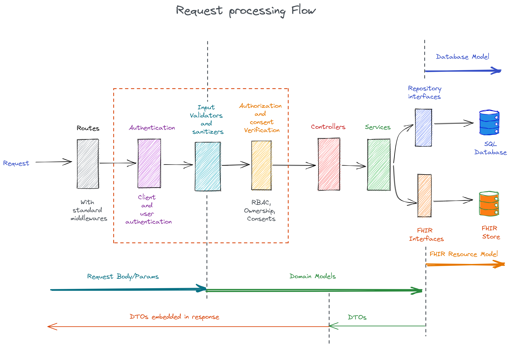

# Design considerations

The following are the goals of the current design of the system.

1. __Open architecture__ - 
   __Use default or bring your own!__ The current design supports freedom to choose individual components in multple areas. The service currently gives out-of-the-box default modules, but if somebody wants to replace the default module with their own, it is perfectly possible. The replacing modules have to support a given interface or need to be wrapped to support the interfaces. Dependency injection has been utilized to have a loose coupling between different areas of the service. The areas which currently support the replacable modules are - 
   *  __Authentication and Authorization__ - You can plugg in your own own auth service.
   *  __Database engines__ - Through basic repository interface. Default is any SQL database through [Sequelize ORM](https://sequelize.org/). Tested with MySQL and PostgreSQL. So the possibilities are -
      *  SQL-based (currently supported through sequelize) - e.g. MySQL, PostgreSQL, SQL server, SQLite,...
      *  NoSQL based databases such as MongoDB
   *  __FHIR storage__ - Current default implementation supports [Google's Healthcare FHIR api (Version R4)](https://cloud.google.com/healthcare/docs/concepts/fhir), but it should be very easy to add Azure FHIR API or Hapi server.
   *  __Clinical NLP service module__ - Currently this service is not fully integrated with this code base, but the work is in progress. The service supports out-of-the-box provider plugins for [Google Healtcare Natural language API](https://cloud.google.com/healthcare/docs/concepts/nlp) and AWS [Amazon Comprehend Medical](https://aws.amazon.com/comprehend/medical/).

    Eventually following modules will have plug and play architecture - 
    * __Care plan module__
    * __Emergency protocol module__
    * __Resource management module__
    * __Appointment service module__
    * __Scheduler__
  
2. __Domain driven design with clear separation of concerns__
    * Domain specific definitions of entities
    * Code against interface
    * Testability of individual components

3. __Extensible core functionalities__ - with emphasis on customization.
   As an example, with care plan module, you can define your own care plan template around a particular patient condition. This template can be defined as a JSON file. 

# Where does REANCare service fit?
REANCare service is central core service which has following major responsibilities. It provides a set of APIs to -
1. Stakeholders management: For multiple stake-holders such as patients, doctors, labs, clinics, pharmacies, etc.
2. Patient EHR data management: Add/update/retrieve patient EHR data through a controlled access (through proper authentication, authorisation and consent management).
3. Core infrastructure: To handle patient's health management tasks, such as
   1. Medications
   2. Appointments with doctors and labs
   3. Custom health goals
   4. Nutrition
   5. Stress management
   6. Physical activity
4. Template engine to define/create/schedule custom care plans 
5. Template engine for define/create/manage emergency protocols

Following figure shows the current communication layout of the REAN foundation software components.
  

# Internals

The following figure depicts the internals of the service showing the path of request processing.

  

  1. Incoming request is processed through standard set of middlewares.
  2. Client and user are authenticated.
  3. Validators and sanitizers process the request input and convert it to domain models.
  4. Authorization layer performs RBAC authorization, ownership authorization and consent validation.
  5. Controllers accept domain models and calls one or more services based on business logic.
  6. Services pass the domain models to database repository interfaces as well as to FHIR interfaces.
  7. Database repository interfaces convert domain models to database models and perform relevant actions.
  8. FHIR interfaces convert domain models to FHIR resource format.
  9. The database models returned by database ORM will be converted by repository interfaces into DTOs.
  10. Controllers embed DTOs into the response.
  11. Response is served.
