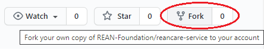

# How to setup development environment

## Technology stack
1. [Node.js](https://nodejs.org/en/) (Minimum version 12.14.1)
2. [TypeScript](https://www.typescriptlang.org/) (Minimum version 4.2.4)
3. [Sequelize](sequelize.org) - as a default module for SQL databases if you are fine with default version
4. [MySQL](https://dev.mysql.com/downloads/mysql/) - (MySQL Community Server 8.0.25) or [PostgreSQL](https://www.postgresql.org/download/) - (Minimum Version 12.x)
5. Optional: If you want to use FHIR service, user the one using version R4. Default is [GCP FHIR](https://cloud.google.com/healthcare/docs/concepts/fhir) for which you have enable the GCP API for FHIR and set the creds.

## Recommended Tools on Development Machine
1. Visual Studio Code with following extensions
    - ESLint by Dirk Baeumer
    - DotENV by mikestead
    - Prettier Code Formatter by Prettier
2. MySQL Workbench
3. Postman

## Development machine set-up

* Clone this repository
  
  `clone git@github.com:REAN-Foundation/reancare-service.git <your-local-folder>`

  or
  fork the repository
  

* Install all the prerequisites as listed in [technology stack](#technology-stack).
* Open the root directory of the folder where you have cloned/forked the repository in Visual Studio Code.
* Go to terminal of VSCode and type `npm install`. This will install all the dependency packages.
* Open <your-root-folder>/.env.sample file and change the name to .env. Update the environment variables in .env file to the ones which are available on your machine.
* Debug mode: 
  * Make sure you have <your-root-folder>/.vscode/launch.json file available.
  * Click on debug button on left panel and you should see 'Launch Program' option against 'RUN AND DEBUG' label.
  * Click on 'Play' button against 'Launch Program' to start the service in debug mode.
* Normal mode: 
  * To start service in regular mode, go to the terminal and run `npm start`.
* You should be able to see server start messages.
* Congratulations, your local REANCare service is up and running!

## Testing the service with Postman
There is a comprehensive set of postman requests in the collection *'reancare.default.postman_collection.json'* located inside folder *'\<your-root-folder\>/postman/'*. 

__Steps to run the default postman collection requests__

1. Import the postman collection JSON file.
2. Import the environment by importing environment JSON file, - *'reancare.default.local.postman_environment.json'*.
3. Select the imported environment in Postman.
4. When you are starting, it is advisable to execute the requests in sequential order from top-to-bottom.

Please refer our [Coding Style and Guidelines](coding-style-and-guidelines.md).

Want to add a new feature/API/Model CRUD API? please refer [Checklist to add new API or model](checklist-to-add-api.md).

